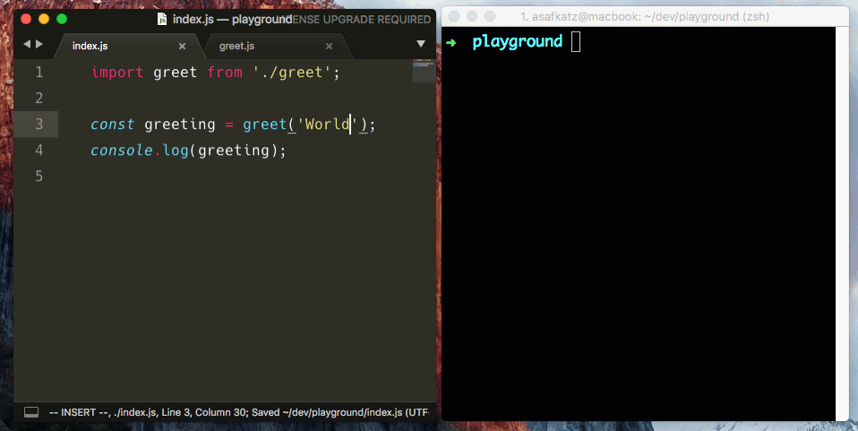

# hack-cli
Standalone Devtools for prototyping & debugging.



# Features
- Standalone DevTools
- Live reloading
- Support for ES modules (import/export)
- Built on top of electron, which means that both Node.js modules & The Browser's APIs are available

# Install
```
npm i -g hack-cli
```

# Usage

Run: 
```
hack ./file.js
```
To open an independent devtools window.
It will reload automatically on every file change.

### ES Modules
By default, it uses commonJS modules.
But you can enable support for ES module too:

```
hack ./file.js --esm
```

It uses `@std/esm` under the hood

---

Inspired by [Jam3/devtool](https://github.com/Jam3/devtool)
